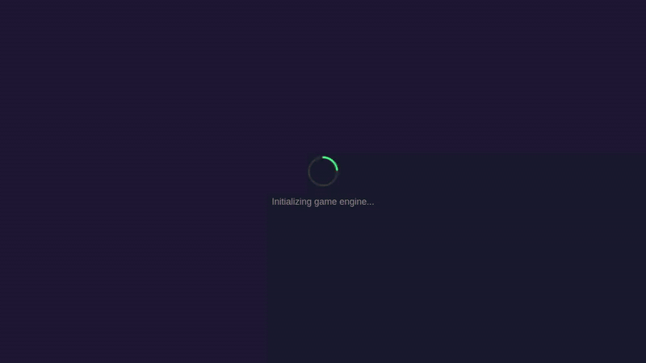
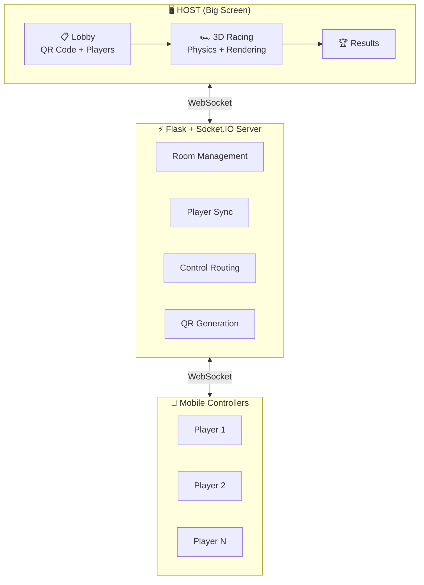
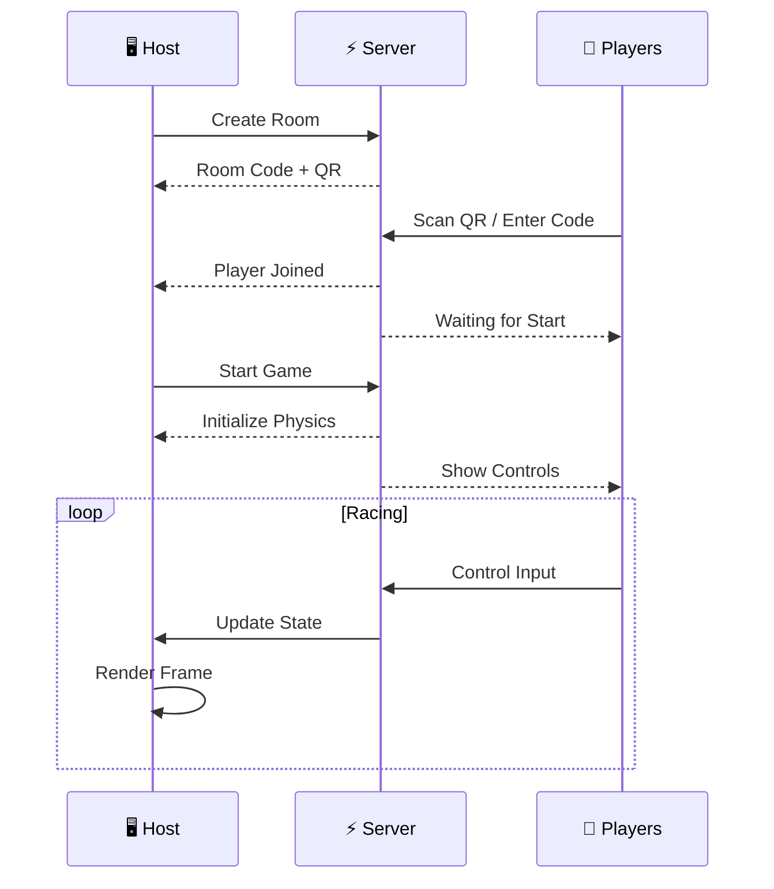

<div align="center">

# 🏎️ Multiplayer Racer

### *Real-time browser-based multiplayer racing on the big screen*

[](https://github.com/cdilga/multiplayer-racer/actions/workflows/test.yml)
[](https://www.gnu.org/licenses/gpl-3.0)
[](https://python.org)
[](https://nodejs.org)
[](https://threejs.org)
[](https://rapier.rs)
[](https://socket.io)

<br />



*Up to 32 cars racing simultaneously with real-time 3D physics!*

<br />

**Connect your phone. Race your friends. Epic party game chaos.**

Support for **1-32 players** • Full physics simulation • WebGL rendering

[Getting Started](#-quick-start) •
[Features](#-features) •
[How It Works](#-how-it-works) •
[Development](#-development) •
[Roadmap](#-roadmap)

</div>

---

## 🎮 What is Multiplayer Racer?

Multiplayer Racer is a **Jackbox/Kahoot-style party racing game** where players use their smartphones as controllers while the race displays on a shared screen (TV, projector, or monitor).

Perfect for:
- 🎉 **Party nights** - Everyone joins with their phone
- 🏠 **Living room gaming** - No extra controllers needed
- 🎊 **Events & gatherings** - Easy setup, instant fun

### Key Highlights

| Feature | Description |
|---------|-------------|
| 🏎️ **Massive Scale** | Support for 1-32 players racing simultaneously |
| 📱 **Phone as Controller** | Touch controls optimized for mobile |
| 📺 **Big Screen Display** | 3D racing view with WebGL rendering |
| 🔗 **Easy Join** | QR code or room code to connect instantly |
| ⚡ **Real-time Physics** | Rapier 3D engine with WebSocket sync |
| 🎵 **Dynamic Audio** | Music tracks & sound effects |
| 🔧 **Physics Tuning** | Built-in debug panels for customization |

---

## 🚀 Quick Start

### Prerequisites

- **Python 3.11+** with pip
- **Node.js 20+** with npm
- Modern web browser with WebGL support

### Installation

```bash
# Clone the repository
git clone https://github.com/cdilga/multiplayer-racer.git
cd multiplayer-racer

# Install Python dependencies
pip install -r requirements.txt

# Install Node.js dependencies
npm install
```

### Start Racing

```bash
# Start the server
python server/app.py
```

Open your browser to **http://localhost:8000** - you're ready to race!

### Join the Game

1. **Host** opens the game on a big screen/TV
2. **Players** scan the QR code or enter the room code on their phones
3. **Everyone** picks a name and joins the lobby
4. **Host** clicks "Start Race" when ready

---

## ✨ Features

### 🏁 Multiplayer Racing
- **Massive multiplayer support** - Up to 32 players racing simultaneously
- **Room-based matchmaking** with 4-character codes
- **QR code join** - Scan and play instantly
- **Real-time synchronization** via WebSockets with sub-100ms latency

### 🎮 Mobile Controls
- **Touch joystick** for steering
- **Accelerate/brake buttons** optimized for thumbs
- **Full-screen mode** for immersive play
- **Responsive design** for all screen sizes

### 🚗 3D Racing Experience
- **Three.js rendering** with smooth 60fps gameplay
- **Rapier physics engine** for realistic car handling
- **Dynamic camera** following the action
- **Multiple track designs** (oval, figure-8)

### 🎵 Audio System
- **6 music tracks** for different game phases
- **Sound effects** for collisions, engines, UI
- **Audio ducking** for clear SFX over music
- **Volume controls** built into the UI

### 🔧 Developer Tools
- **Physics debug panel** (Press F4) - Tune car handling live
- **Stats overlay** (Press F3) - FPS, physics updates, player info
- **Keyboard controls** for testing without mobile
- **Comprehensive test suite** with Playwright

---

## 🔄 How It Works

### System Architecture



### Game Flow



---

## 🛠️ Development

### Tech Stack

| Layer | Technology |
|-------|------------|
| **Frontend** | Three.js, Vanilla JS, CSS |
| **Physics** | Rapier 3D (WASM) |
| **Backend** | Flask + Flask-SocketIO |
| **Real-time** | Socket.IO |
| **Testing** | Playwright E2E |
| **Build** | Vite |

### Project Structure

```
multiplayer-racer/
├── server/              # Flask backend
│   └── app.py          # Main server (rooms, WebSocket handling)
├── frontend/            # HTML templates
│   ├── host/           # Big screen interface
│   └── player/         # Mobile controller interface
├── static/
│   ├── js/             # Game logic
│   │   ├── host.js     # Host game loop & rendering
│   │   ├── player.js   # Mobile controls
│   │   ├── rapierPhysics.js  # Physics integration
│   │   ├── audioManager.js   # Sound system
│   │   ├── carModel.js       # 3D car geometry
│   │   └── trackBuilder.js   # Track generation
│   ├── css/            # Stylesheets
│   └── audio/          # Music & SFX
├── tests/e2e/          # Playwright test suite
└── docs/               # Documentation & images
```

### Running Tests

```bash
# Run all tests
npm test

# Run with visible browser
npm run test:headed

# Run with Playwright UI
npm run test:ui
```

### Creating Demo Videos

Capture gameplay footage for documentation:

```bash
# Standard 2-player demo
npx tsx scripts/capture-video.ts

# 32-player stress test demo
npx tsx scripts/capture-32-cars.ts
```

**Note**: Video capture requires a running server (`python server/app.py`) and `ffmpeg` for GIF conversion.

### Debug Controls (Host)

| Key | Action |
|-----|--------|
| `F3` | Toggle stats overlay |
| `F4` | Toggle physics parameters panel |
| `R` | Reset all cars |
| `Arrow Keys` | Test drive controls |

---

## 🗺️ Roadmap

### Current Status: Alpha

The game is fully playable locally with core features working:
- [x] Room creation & QR code joining
- [x] Mobile touch controls
- [x] 3D rendering with Three.js
- [x] Rapier physics integration
- [x] Real-time multiplayer sync
- [x] Audio system with music & SFX
- [x] Debug/tuning tools

### Coming Soon

| Phase | Features |
|-------|----------|
| **Phase 1** | Damage system, explosions, improved physics |
| **Phase 2** | Multiple game modes (Derby, Race) |
| **Phase 3** | More tracks, obstacles, power-ups |
| **Phase 4** | Online hosting, public lobbies |
| **Phase 5** | Steam release, car customization |

> 🌐 **Online Demo** - Coming soon! Currently local network only.

---

## 🤝 Contributing

Contributions are welcome! This project follows Test-Driven Development:

1. **Fork** the repository
2. **Create** a feature branch (`git checkout -b feature/amazing-feature`)
3. **Write tests first** (they should fail)
4. **Implement** the feature (make tests pass)
5. **Commit** your changes (`git commit -m 'Add amazing feature'`)
6. **Push** to the branch (`git push origin feature/amazing-feature`)
7. **Open** a Pull Request

See [CLAUDE.md](CLAUDE.md) for detailed development guidelines.

---

## 📄 License

This project is licensed under the **GNU General Public License v3.0** - see the [LICENSE](LICENSE) file for details.

---

## 🙏 Acknowledgments

- [Three.js](https://threejs.org) - 3D graphics library
- [Rapier](https://rapier.rs) - Physics engine
- [Flask](https://flask.palletsprojects.com) & [Socket.IO](https://socket.io) - Backend framework
- [Playwright](https://playwright.dev) - E2E testing

---

<div align="center">

**Made with ❤️ for party game nights**

[⬆ Back to Top](#️-multiplayer-racer)

</div>
