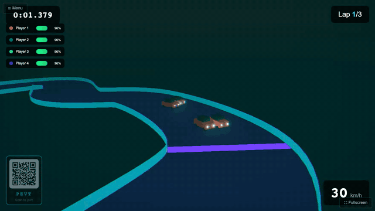
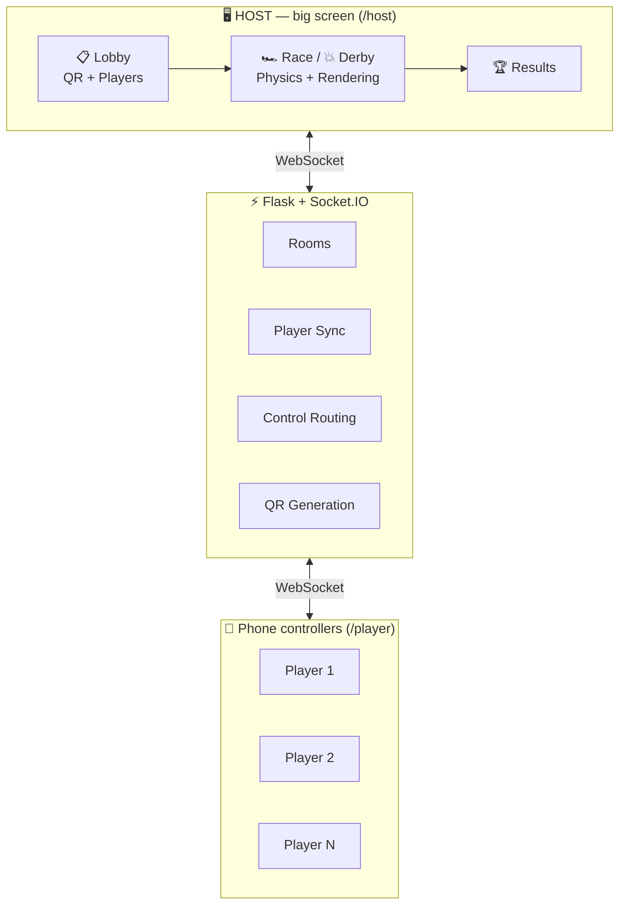

<div align="center">

# 🎮 Joystick Jammers

> **Play it live: [jammers.dilger.dev](https://jammers.dilger.dev)** — open on a big screen, players join by scanning the QR with their phones. No installs.

### *Your phone is the controller. Your TV is the arena. Race, ram, and wreck your friends — straight from the browser.*

[](https://github.com/cdilga/multiplayer-racer/actions/workflows/test-fast.yml)
[](https://github.com/cdilga/multiplayer-racer/actions/workflows/test-e2e.yml)
[](https://www.gnu.org/licenses/gpl-3.0)
[](https://python.org)
[](https://nodejs.org)
[](https://threejs.org)
[](https://rapier.rs)
[](https://socket.io)

<br />



*Open on a big screen → players scan the QR → race or wreck. That's it.*

<br />

[Play Live](https://jammers.dilger.dev) •
[Quick Start](#-quick-start) •
[Features](#-features) •
[How It Works](#-how-it-works) •
[Development](#-development) •
[Roadmap](#-roadmap)

</div>

---

## 🎉 What is Joystick Jammers?

Joystick Jammers is a **Jackbox/Kahoot-style couch party game**. The action plays out on a shared big screen (TV, projector, or laptop), and everyone joins with the device already in their pocket — their phone becomes the controller. No app store, no extra hardware, no installs.

Two ways to play:

- 🏁 **Race** — weaponised laps around procedurally generated tracks. Grab pickups, take the racing line, leave your friends in the dust.
- 💥 **Demolition Derby** — last car standing. The arena shrinks, weapons escalate, and chaos compounds. Best of 3 rounds.

Perfect for party nights, living-room gaming, and questionable driving decisions.

### Why it's fun

| | |
|---|---|
| 📱 **Phone as controller** | Touch joystick + buttons. Just scan and play. |
| 📺 **Big-screen arena** | 3D action with bloom, particles, and a chase cam. |
| 🔗 **One-tap join** | QR code or a 4-letter room code. |
| 💣 **8 weapons & pickups** | Missile, Mine, Boost, Oil Slick, Sniper, Shield, EMP, Flamethrower. |
| 🌍 **Procedural arenas** | New tracks and terrain every game. |
| 👥 **Built for a crowd** | Plenty of players, one screen, total mayhem. |

---

## 🚀 Quick Start

### Prerequisites

- **Python 3.11+** with pip
- **Node.js 20+** with npm
- A modern browser with WebGL

### Installation

```bash
git clone https://github.com/cdilga/multiplayer-racer.git
cd multiplayer-racer

pip install -r requirements.txt   # Python deps
npm install                       # Node deps
npm run build                     # Build the frontend into dist/
```

### Run it

```bash
python server/app.py
```

Open **http://localhost:8000** — you'll land on the start screen.

- **Host Now** → the big-screen host (`/host`)
- **Join Game** → the phone controller (`/player`)

> 💡 **Dev tip:** append `?dev=1` to the landing URL (`http://localhost:8000/?dev=1`) to skip straight to the host every time — handy for rapid iteration. Use `?dev=0` to turn the bypass back off.

### Join a game

1. **Host** opens the game on a big screen and clicks **Host Now**.
2. **Players** scan the QR code (or type the 4-letter room code) on their phones.
3. **Everyone** picks a name and lands in the lobby.
4. **Host** chooses Race or Derby and starts the game.

---

## ✨ Features

### 🏁 Two game modes
- **Race** — configurable laps, weapon pickups, lap timing, live positions.
- **Demolition Derby** — last-car-standing elimination, best-of-3 rounds, a shrinking arena, and weapons that escalate as the match heats up.

### 💥 Weapons & pickups
Eight pickups across rarity tiers — **Missile, Mine, Boost, Oil Slick, Sniper, Shield, EMP, Flamethrower** — with rarer drops appearing later in a match. Grab one, hold it, fire at the perfect moment.

### 🚗 3D physics & visuals
- **Rapier 3D** vehicle physics (WASM) with collision damage and destruction.
- **Three.js** rendering with bloom, fog, particles, trails, and a dynamic chase camera.
- **Procedural tracks + terrain** so no two arenas feel the same.

### 📱 Mobile controls
- Touch joystick for steering, thumb-friendly accelerate/brake, and a fire button in combat.
- Full-screen support and a responsive layout tuned for phones.
- One-tap **Reset My Car** escape hatch when you get stuck or flipped.

### 🎵 Audio
- Multiple music tracks for different phases, synthesised engine sound, and SFX with ducking so effects cut through.

### 🐞 In-game bug reporter
- A **Report a Bug** button in both the host and player menus captures a screenshot plus a game-state snapshot (room code, mode, players, FPS) and opens a pre-filled email — so reports can be matched to server logs.

### 🔧 Developer tools (host)
| Key | Action |
|-----|--------|
| `D` | Toggle debug info |
| `F2` | Physics tuning panel |
| `F3` | Stats overlay (FPS, players, state) |
| `F4` | Physics debug visualisation |

---

## 🔄 How It Works


```mermaid
flowchart TB
    subgraph HOST["🖥️ HOST — big screen (/host)"]
        direction LR
        L["📋 Lobby<br/>QR + Players"]
        R["🏎️ Race / 💥 Derby<br/>Physics + Rendering"]
        E["🏆 Results"]
        L --> R --> E
    end

    subgraph SERVER["⚡ Flask + Socket.IO"]
        RM["Rooms"]
        PS["Player Sync"]
        CR["Control Routing"]
        QR["QR Generation"]
    end

    subgraph PLAYERS["📱 Phone controllers (/player)"]
        P1["Player 1"]
        P2["Player 2"]
        PN["Player N"]
    end

    HOST <-->|"WebSocket"| SERVER
    SERVER <-->|"WebSocket"| PLAYERS
```

The host renders the 3D world and runs the physics; phones stream control input over WebSockets. A lightweight landing page at `/` is the shareable front door and routes players to the right screen.

---

## 🛠️ Development

### Tech stack

| Layer | Technology |
|-------|------------|
| **Frontend** | Three.js, vanilla JS (ES modules), CSS |
| **Physics** | Rapier 3D (WASM) |
| **Backend** | Flask + Flask-SocketIO |
| **Real-time** | Socket.IO |
| **Build** | Vite (landing / host / player entry points) |
| **Testing** | Vitest (unit/integration) + Playwright (E2E) |
| **Deploy** | Docker + Cloudflare Tunnel (jammers.dilger.dev) |

### Project structure

```
multiplayer-racer/
├── server/app.py            # Flask + Socket.IO (rooms, QR, routes: / /host /player)
├── frontend/
│   ├── landing/             # Marketing landing page (Vite entry)
│   ├── host/                # Big-screen host (Vite entry)
│   └── player/              # Phone controller (Vite entry)
├── src/host/main.js         # Host bootstrap (loads GameHost)
├── static/
│   ├── js/
│   │   ├── GameHost.js      # Host orchestrator
│   │   ├── engine/          # Engine, GameLoop, EventBus, StateMachine
│   │   ├── systems/         # Render, Physics, Network, Race, Derby, Weapons, Audio…
│   │   ├── entities/        # Vehicle, Track
│   │   ├── resources/       # TrackFactory, terrain, procedural generation
│   │   ├── ui/              # LobbyUI, RaceUI, GameMenuUI, BugReportUI…
│   │   ├── input/           # InputManager, TouchController
│   │   └── player.js        # Phone controller logic
│   ├── css/                 # host.css, player.css, landing.css
│   ├── audio/               # Music & SFX
│   └── og-image.png         # Social share image
├── tests/                   # Vitest (unit/integration) + Playwright (e2e)
└── docs/images/             # README media
```

> ⚠️ **The Flask server serves from `dist/` when it exists.** After changing any
> JS/CSS, run `npm run build` before testing in the browser. See [CLAUDE.md](CLAUDE.md).

### Tests

```bash
npm test                 # unit + integration (Vitest)
npm run test:e2e         # core 4-player flow (Playwright)
npm run test:e2e:all     # full E2E suite
npm run test:headed      # E2E with a visible browser
```

---

## 🗺️ Roadmap

**Playable today:**
- [x] Landing page + one-tap QR/room-code join
- [x] Vite-bundled ESM architecture (no CDNs)
- [x] Race mode (laps, pickups, timing)
- [x] Demolition Derby (elimination, shrinking arena, weapon escalation)
- [x] 8 weapons & pickups
- [x] Rapier physics, collision damage & destruction
- [x] Procedural tracks + terrain
- [x] Audio (music, engine synth, SFX)
- [x] In-game bug reporter
- [x] Live deploy at [jammers.dilger.dev](https://jammers.dilger.dev)

**Next up:**

| Phase | Ideas |
|-------|-------|
| **June 2026 Swarm** | **Polishing Pass:** Wheelie mechanics, boost payoff, player identity/markers, controller reconnect stability, and map/collision fixes. |
| **Near term** | More tracks & arena hazards, car customisation, spectator polish |
| **Later** | Public lobbies, persistent stats/leaderboards, more modes |

---

## 🤝 Contributing

Contributions welcome — this project follows Test-Driven Development:

1. **Fork** and branch (`git checkout -b feature/amazing-thing`)
2. **Write a failing test** first
3. **Implement** until it passes
4. **`npm run build`** and run the suite
5. **Open a PR**

See [CLAUDE.md](CLAUDE.md) for detailed guidelines.

---

## 📄 License

Licensed under the **GNU General Public License v3.0** — see [LICENSE](LICENSE).

---

## 🙏 Acknowledgments

- [Three.js](https://threejs.org) — 3D graphics
- [Rapier](https://rapier.rs) — physics
- [Flask](https://flask.palletsprojects.com) & [Socket.IO](https://socket.io) — backend & real-time
- [Playwright](https://playwright.dev) & [Vitest](https://vitest.dev) — testing

---

<div align="center">

**Made for couches, parties, and questionable driving decisions.**

[⬆ Back to Top](#-joystick-jammers)

</div>
